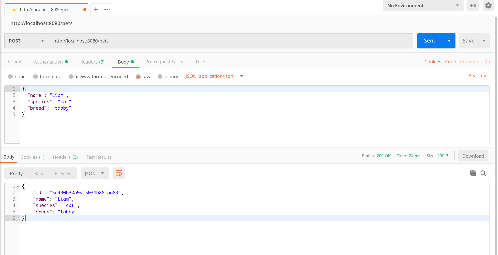

# spring-boot-rest-mongodb

#### REST API: Java Spring Boot and MongoDB

Creating a RESTful web service using the Spring Boot framework and MongoDB

#### Why Spring Boot?

The Java Spring Boot framework provides a powerful set of tools for web development on both the front-end and back-end. It has built-in configuration for security and database access, as well as simple request mappings. This framework is highly configurable and makes web development extremely simple.

#### Why MongoDB?

Mongo is quickly growing in popularity among NoSQL databases. Read more about NoSQL and its benefits here. MongoDB, specifically, is perfect for developing a REST API with Spring Boot for a couple of key reasons:

* Data is stored in MongoDB as JSON
* Spring Boot provides a powerful MongoDB connector

#### Tools Used in this Tutorial

1. Java
2. Spring Boot
3. Maven
4. MongoDB
5. Postman

#### Step 1: Creating a Database

This tutorial assumes that you already have an accessible instance of MongoDB that you can connect to. For more information on getting started with MongoDB, visit their online tutorial.

Let us start by creating a test database. I will call mine “halaqohIT” using the following command in the MongoDB shell, or through a database manager like MongoDB Compass:

```
use halaqohIT;
```

This will create a new database in MongoDB that we can use for our tutorial.

#### Step 2: Adding a MongoDB Collection and Data

In MongoDB, collections are analogous to tables in a relational database — they hold the data that we will be querying using our REST API. I will be creating a sample collection that will hold data about different types of pets. Let’s create the collection with the following command:
```
db.createCollection(“pets”);
```
Once the collection is created, we need to add some data! This collection will hold the names, breeds, and species of various pets, so a single document would be formatted as follows:
```
{
  “name” : “Spot”,
  “species” : “dog”,
  “breed” : “pitbull”
}
```
We can add data to the collection with the following command:
```
db.pets.insertMany([
  {
    “name” : “Spot”,
    “species” : “dog”,
    “breed” : “pitbull”
  },
  {
    “name” : “Daisy”,
    “species” : “cat”,
    “breed” : “calico”
  },
  {
    “name” : “Bella”,
    “species” : “dog”,
    “breed” : “australian shepard”
  }
]);
```
Querying the collection with `db.pets.find({});` reveals that MongoDB automatically assigns a unique _id field to each document to make it easier to find and edit documents.

#### Using Spring Initializr to Create a Project

Spring offers a tool called the Spring Initializr to help jump-start your Spring Boot project. Access the Initializr at start.spring.io, and enter the following information:

* Group: This is the package name

    Example: com.kominfo.halaqohit

* Artifact: This is the project name

    Example: rest.api.pets

* Dependencies: These are the features that will be added to your project (remember, you can always add these later).

    Our tutorial will use the “Web” and “MongoDB” dependencies

Then click `Generate Project` to download a .zip file with the basic project structure.


#### Adding Model to Spring Boot Project

With the project downloaded from the Spring Initializr, you can now open it in your favorite IDE to begin editing the project.
First, we will want to add a pets model, so that Spring will know what kind of data the database will return.
We can do this by creating a new folder in `src/main/java/[package name]/` called “models”. In the new “models” folder,
we can create a file called Pets.java. This Java class will hold the basic structure of a document in the “pets” collection,
so the class looks as follows:

```
package com.kominfo.halaqohit.springbootdatajpamongodb.entity;

import org.springframework.data.annotation.Id;
import org.springframework.data.mongodb.core.mapping.Document;

@Document
public class Pets {
    @Id
    public String id;

    public String name;
    public String species;
    public String breed;

    // Constructors
    public Pets() {
    }

    public Pets(String id, String name, String species, String breed) {
        this.id = id;
        this.name = name;
        this.species = species;
        this.breed = breed;
    }

    public String getId() {
        return id;
    }

    public void setId(String id) {
        this.id = id;
    }

    public String getName() {
        return name;
    }

    public void setName(String name) {
        this.name = name;
    }

    public String getSpecies() {
        return species;
    }

    public void setSpecies(String species) {
        this.species = species;
    }

    public String getBreed() {
        return breed;
    }

    public void setBreed(String breed) {
        this.breed = breed;
    }
}
```

The `@Id` annotation tells spring that the `id` field will be used as the primary identifier.
The rest of the class contains the basic constructors, getters, and setters for the Pets object.

#### Adding Repository to Spring Boot Project

Now that we have a model that identifies the data structure stored in the database to Spring Boot,
we can create the connector between the model and MongoDB. This is done through a Repository interface.
We can create this first by making a new folder called “repositories” in `src/main/java/[package name]/`.

In the new “repositories” folder, we can create a file called `PetsRepository.java`. The name of this repository is extremely
important because it tells MongoDB the collection that it will be querying (in this case, the pets collection).
This interface will extend the MongoRepository class, which already contains generic methods like `save` (for creating/updating documents)
and `delete` (for removing documents), but we will need to specify additional methods ourselves.

Luckily, we do not need to manually implement these queries, we can simply use Spring Boot’s repository naming conventions, and the MongoRepository will intelligently construct the queries at runtime. This means that our interface will be extremely simple, as follows:
```
import com.kominfo.halaqohit.springbootdatajpamongodb.entity.Pets;
import org.springframework.data.mongodb.repository.MongoRepository;

import java.util.Optional;

public interface PetsRepository extends MongoRepository<Pets, String> {
    Optional<Pets> findById(String id);
}
```

#### Adding the MongoDB Connection Info

To tell Spring the connection information for our MongoDB, we will need to add conection details to the `application.properties` file,
located in the `src/main/resources` folder. Add the following lines to the file, replacing the information in brackets with the information specific to your MongoDB instance:
```
#Local MongoDB config
spring.data.mongodb.host=localhost
spring.data.mongodb.port=27017
spring.data.mongodb.database=halaqohIT
```
This is all the information that Spring will need to connect to the database.

#### Creating REST Controller

Spring should now be able to connect to MongoDB, so now we can establish the endpoints that we can contact to interact with the database.
This will be done in a Spring Rest Controller, which uses Request Mappings to map requests with functions.
We can create a Rest Controller by adding a file called `PetsController.java` to the `src/main/java/[package name]/` folder.
The basic file structure will look as follows:
```
package com.kominfo.halaqohit.springbootdatajpamongodb.controller;

import com.kominfo.halaqohit.springbootdatajpamongodb.entity.Pets;
import com.kominfo.halaqohit.springbootdatajpamongodb.repository.PetsRepository;
import org.springframework.beans.factory.annotation.Autowired;
import org.springframework.http.HttpStatus;
import org.springframework.http.ResponseEntity;
import org.springframework.web.bind.annotation.*;

import javax.validation.Valid;
import java.util.List;
import java.util.Optional;

/**
 * Created by IntelliJ IDEA.
 * Project : spring-boot-data-jpa-mongodb
 * User: hendisantika
 * Email: hendisantika@gmail.com
 * Telegram : @hendisantika34
 * Date: 2019-01-17
 * Time: 05:52
 * To change this template use File | Settings | File Templates.
 */
@RestController
@RequestMapping("/pets")
public class PetsController {
    @Autowired
    private PetsRepository repository;

}
```

The `@RestController` annotation tells Spring that this class will requested by URL and will return data to the requester.
The `@RequestMapping` annotation specifies the base URL that the controller will be handling, so any request to the host
starting with ``/pets` will be directed to this controller. The `@Autowired` annotation creates an instance of
the `PetsRepository` object that will allow us to access and modify the pets database.

#### Adding the REST Endpoints

All of the following enpoints will be added directly into the PetsController class.

**GET**

```
@GetMapping
public List<Pets> getAllPets() {
    return repository.findAll();
}

@GetMapping("/{id}")
public ResponseEntity<Pets> getPetById(@PathVariable("id") String id) {
    Optional<Pets> petData = repository.findById(id);
    if (petData.isPresent()) {
        return new ResponseEntity<>(petData.get(), HttpStatus.OK);
    } else {
        return new ResponseEntity<>(HttpStatus.NOT_FOUND);
    }

}
```

The first mapping takes any `GET` requests to the host with a URL of `/pets/` and maps them to the getAllPets() method,
which requests all documents from the pets collection.

The second mapping takes and `GET` requests to the host with a URL of `/pets/` followed by an ObjectId and maps them to the getPetById() method,
which searches the pets collection for the document with an `id` field equal to the ObjectId in the URL.

**PUT**
```
@PutMapping("/{id}")
public void modifyPetById(@PathVariable("id") String id, @Valid
@RequestBody Pets pets) {
    pets.setId(id);
    repository.save(pets);
}
```
This mapping expects a request body (in JSON format) with each of the fields that a Pets object contains (`name`, `species`, and `breed`).
The id in the request URL is the `id` of the document to be modified.

**POST**

```
@PostMapping
public Pets createPet(@Valid @RequestBody Pets pets) {
    repository.save(pets);
    return pets;
}
```

This mapping expects a request body (in JSON format) with each of the fields that a Pets object contains (`name`, `species`, and `breed`), and assigns it a new ObjectId.
This object is then inserted into the pets collection, and the new Pets object is returned.

**DELETE**
```
@DeleteMapping("/{id}")
public ResponseEntity<String> deletePet(@PathVariable String id) {
    try {
        repository.deleteById(id);
    } catch (Exception e) {
        return new ResponseEntity<>("Fail to delete!", HttpStatus.EXPECTATION_FAILED);
    }

    return new ResponseEntity<>("Pet has been deleted!", HttpStatus.OK);
}
```

This endpoint takes the `id` of a document in the `pets` collection and removes that document from the collection.

#### Completed Controller
```
package com.kominfo.halaqohit.springbootdatajpamongodb.controller;

import com.kominfo.halaqohit.springbootdatajpamongodb.entity.Pets;
import com.kominfo.halaqohit.springbootdatajpamongodb.repository.PetsRepository;
import org.springframework.beans.factory.annotation.Autowired;
import org.springframework.http.HttpStatus;
import org.springframework.http.ResponseEntity;
import org.springframework.web.bind.annotation.*;

import javax.validation.Valid;
import java.util.List;
import java.util.Optional;

/**
 * Created by IntelliJ IDEA.
 * Project : spring-boot-data-jpa-mongodb
 * User: hendisantika
 * Email: hendisantika@gmail.com
 * Telegram : @hendisantika34
 * Date: 2019-01-17
 * Time: 05:52
 * To change this template use File | Settings | File Templates.
 */
@RestController
@RequestMapping("/pets")
public class PetsController {
    @Autowired
    private PetsRepository repository;

    @GetMapping
    public List<Pets> getAllPets() {
        return repository.findAll();
    }

    @GetMapping("/{id}")
    public ResponseEntity<Pets> getPetById(@PathVariable("id") String id) {
        Optional<Pets> petData = repository.findById(id);
        if (petData.isPresent()) {
            return new ResponseEntity<>(petData.get(), HttpStatus.OK);
        } else {
            return new ResponseEntity<>(HttpStatus.NOT_FOUND);
        }

    }

    @PutMapping("/{id}")
    public void modifyPetById(@PathVariable("id") String id, @Valid
    @RequestBody Pets pets) {
        pets.setId(id);
        repository.save(pets);
    }

    @PostMapping
    public Pets createPet(@Valid @RequestBody Pets pets) {
        repository.save(pets);
        return pets;
    }

    @DeleteMapping("/{id}")
    public ResponseEntity<String> deletePet(@PathVariable String id) {
        try {
            repository.deleteById(id);
        } catch (Exception e) {
            return new ResponseEntity<>("Fail to delete!", HttpStatus.EXPECTATION_FAILED);
        }

        return new ResponseEntity<>("Pet has been deleted!", HttpStatus.OK);
    }

    @DeleteMapping("/all")
    public ResponseEntity<String> deleteAllPets() {
        try {
            repository.deleteAll();
        } catch (Exception e) {
            return new ResponseEntity<>("Fail to delete!", HttpStatus.EXPECTATION_FAILED);
        }

        return new ResponseEntity<>("All Pets has been deleted!", HttpStatus.OK);
    }
}
```

#### Testing Your API

Now that the controller has all of our endpoints, we can begin testing our API! From the command line, in the project root,
run the `mvn clean spring-boot:run` command to compile the code and start the Spring server with the default port 8080.

Once the server starts, you are free to test your API however you choose.

**POST 'http://localhost:8080/pets'**

With body : `{“name” : “Liam”, “species” : “cat”, “breed” : “tabby”}`
and header : `Content-Type: application/json`

Returns:
```
{
  “_id”: “5aecef5b6d55754834124df3”,
  “name”: “Liam”,
  “species”: “cat”,
  “breed”: “tabby”
}
```



**PUT ‘http://localhost:8080/pets/5aecef5b6d55754834124df3**

With body : `{“name” : “Liam”, “species” : “cat”, “breed” : “siamese”}`
and header : `Content-Type : application/json`

Returns:
```
empty response
```

**GET ‘http://localhost:8080/pets/5aecef5b6d55754834124df3’**

Returns:
```
{
  “_id”: “5aecef5b6d55754834124df3”,
  “name”: “Liam”,
  “species”: “cat”,
  “breed”: “siamese”
}
```


**DELETE ‘http://localhost:8080/pets/5aecef5b6d55754834124df3’**

Returns:
```
empty response
```


**GET ‘http://localhost:8080/pets’**

Returns:
```
[
  {
    “_id”: “5aeccb0a18365ba07414356c”,
    “name”: “Spot”,
    “species”: “dog”,
    “breed”: “pitbull”
  },
  {
    “_id”: “5aeccb0a18365ba07414356d”,
    “name”: “Daisy”,
    “species”: “cat”,
    “breed”: “calico”
  },
  {
    “_id”: “5aeccb0a18365ba07414356e”,
    “name”: “Bella”,
    “species”: “dog”,
    “breed”: “australian shepard”
  }
]
```


Future Articles

Now you have created a REST API using Java Spring Boot and MongoDB! In future articles, I will explain how to add additional features to your API,
such as authentication! I will list the articles here as they become available.